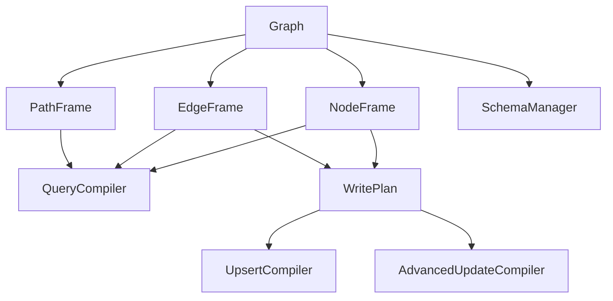
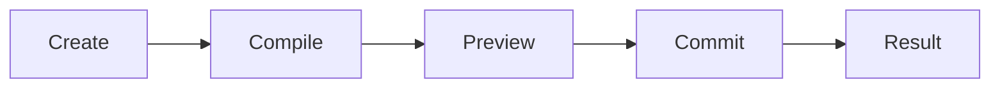

# GraphFrame-Neo4j Technical Documentation

**In-Depth Implementation Details and Architecture**

Summarized by Mistral**
## Table of Contents

1. [Architecture Overview](#architecture-overview)
2. [Core Components](#core-components)
3. [Query Compilation Engine](#query-compilation-engine)
4. [Write Operations System](#write-operations-system)
5. [Traversal and Namespacing](#traversal-and-namespacing)
6. [Parameterization and Security](#parameterization-and-security)
7. [Error Handling](#error-handling)
8. [Performance Considerations](#performance-considerations)
9. [Testing Strategy](#testing-strategy)
10. [Future Enhancements](#future-enhancements)

## Architecture Overview

### System Architecture



### Design Principles

1. **Lazy Evaluation**: All queries are built but not executed until explicitly requested
2. **Immutable Query Plans**: Once compiled, query plans are immutable
3. **Parameterized Everything**: All user data is sent as parameters, never interpolated
4. **Explicit Writes**: Write operations require explicit `.commit()` call
5. **Idempotent Operations**: Upserts are designed to be repeatable without side effects
6. **Chainable API**: All frame methods return `self` for method chaining

### Module Structure

```
src/graphframe_neo4j/
├── __init__.py              # Public API exports
├── graph.py                # Connection management
├── frames/
│   ├── baseframe.py        # Common frame functionality
│   ├── nodeframe.py        # Node query operations
│   ├── edgeframe.py        # Relationship query operations
│   ├── pathframe.py        # Graph traversal operations
│   └── compiler.py         # Query compilation engine
├── write/
│   ├── writeplan.py        # Write operation lifecycle
│   ├── upsert.py           # Upsert compilation
│   └── advanced.py         # Advanced update operations
├── schema/
│   └── manager.py          # Schema operations
└── util/
    ├── errors.py           # Custom exceptions
    └── typing.py           # Type definitions
```

## Core Components

### 1. Graph Class

**Responsibilities:**
- Connection management to Neo4j
- Session handling and transaction support
- Frame creation (NodeFrame, EdgeFrame, PathFrame)
- Schema management access
- Raw Cypher execution

**Key Methods:**

```python
class Graph:
    def __init__(self, uri: str, auth: Tuple[str, str], database: str = "neo4j", **kwargs: Any):
        # Initialize connection parameters
        # Set up driver with retry logic
        # Configure relationship uniqueness policy
    
    def connect(cls, uri: str, auth: Tuple[str, str], database: str = "neo4j", **kwargs: Any) -> 'Graph':
        # Factory method for creating Graph instances
    
    def session(self) -> Session:
        # Create and return a Neo4j session
    
    def nodes(self, label: str) -> NodeFrame:
        # Create a NodeFrame for the given label
    
    def rels(self, rel_type: str) -> EdgeFrame:
        # Create an EdgeFrame for the given relationship type
    
    def schema(self) -> SchemaManager:
        # Return the SchemaManager instance
    
    def cypher(self, query: str, **params: Any) -> Any:
        # Execute raw Cypher with parameters
    
    def to_networkx(self, node_labels: Optional[List[str]] = None, rel_types: Optional[List[str]] = None, limit: Optional[int] = None) -> "nx.Graph":
        # Export subgraph to NetworkX
```

**Connection Management:**
- Uses Neo4j Python driver
- Implements context manager protocol (`__enter__`, `__exit__`)
- Supports multiple databases
- Handles connection errors gracefully

### 2. BaseFrame Class

**Responsibilities:**
- Common functionality for all frame types
- Filter storage and management
- Field selection and projection
- Ordering, limiting, and offsetting
- Query compilation interface

**Key Attributes:**

```python
class BaseFrame:
    def __init__(self, graph: Graph, label: str):
        self._graph = graph            # Associated Graph instance
        self._label = label            # Label/type being queried
        self._filters = []             # List of filter conditions
        self._selected_fields = []     # Fields to select
        self._limit = None             # Result limit
        self._offset = None            # Result offset
        self._order_by = []            # Ordering specifications
```

**Method Chaining:**
All methods return `self` to enable fluent API:

```python
# This is possible because each method returns self
query = g.nodes("Person") \
    .where(age__gte=18) \
    .select("name", "email") \
    .order_by("age__desc") \
    .limit(10)
```

### 3. NodeFrame Class

**Responsibilities:**
- Node-specific query operations
- Traversal initiation
- Write operations on nodes
- Advanced update operations

**Key Methods:**

```python
class NodeFrame(BaseFrame):
    def where(self, **kwargs: Any) -> 'NodeFrame':
        # Parse kwargs into filter conditions
        # Add to self._filters
        # Return self for chaining
    
    def select(self, *fields: str) -> 'NodeFrame':
        # Set selected fields
        # Return self for chaining
    
    def traverse(self, rel_type: str, to: str, direction: str = "out", alias: Optional[Tuple[str, str, str]] = None) -> 'PathFrame':
        # Create a PathFrame for traversal
        # Pass current node label as from_label
    
    def upsert(self, data: Union[List[Dict[str, Any]], Dict[str, Any]], key: Union[str, List[str]], **kwargs: Any) -> 'WritePlan':
        # Create WritePlan for node upsert
        # Validate data and key
        # Return WritePlan instance
    
    def patch(self, **updates: Any) -> 'WritePlan':
        # Create WritePlan for node patch
        # Use current filters as WHERE conditions
    
    def inc(self, field: str, value: Union[int, float]) -> 'WritePlan':
        # Create WritePlan for increment operation
    
    def unset(self, field: str) -> 'WritePlan':
        # Create WritePlan for unset operation
    
    def list_append(self, field: str, value: Any) -> 'WritePlan':
        # Create WritePlan for list append
    
    def list_remove(self, field: str, value: Any) -> 'WritePlan':
        # Create WritePlan for list remove
    
    def map_merge(self, field: str, map_data: Dict[str, Any]) -> 'WritePlan':
        # Create WritePlan for map merge
    
    def delete(self, detach: bool = False) -> 'WritePlan':
        # Create WritePlan for delete operation
```

### 4. EdgeFrame Class

**Responsibilities:**
- Relationship-specific query operations
- Write operations on relationships
- Relationship filtering

**Key Methods:**

```python
class EdgeFrame(BaseFrame):
    def where(self, **kwargs: Any) -> 'EdgeFrame':
        # Parse kwargs into filter conditions for relationships
        # Add to self._filters
        # Return self for chaining
    
    def upsert(self, data: Union[List[Dict[str, Any]], Dict[str, Any]], src: tuple, dst: tuple, rel_key: Optional[Union[str, List[str]]] = None, **kwargs: Any) -> 'WritePlan':
        # Create WritePlan for relationship upsert
        # Validate source and destination specifications
        # Handle relationship key for uniqueness
    
    def patch(self, **updates: Any) -> 'WritePlan':
        # Create WritePlan for relationship patch
    
    def delete(self) -> 'WritePlan':
        # Create WritePlan for relationship delete
```

### 5. PathFrame Class

**Responsibilities:**
- Graph traversal operations
- Multi-hop relationship navigation
- Back traversal to originating nodes
- Namespaced field access

**Key Methods:**

```python
class PathFrame(BaseFrame):
    def __init__(self, graph: 'Graph', rel_type: str, to_label: str, direction: str = "out", alias: Optional[Tuple[str, str, str]] = None, from_label: str = ""):
        # Initialize traversal parameters
        # Set up from/rel/to aliases
        # Store direction information
    
    def where(self, **kwargs: Any) -> 'PathFrame':
        # Parse kwargs with namespaced field support
        # Handle from__prop, rel__prop, to__prop syntax
        # Add to self._filters
        # Return self for chaining
    
    def back(self) -> 'NodeFrame':
        # Create a NodeFrame that represents the originating nodes
        # Copy filters and projections
        # Set up back query compilation
    
    def compile(self) -> Dict[str, Any]:
        # Compile traversal query with proper namespacing
        # Handle custom aliases
        # Generate MATCH pattern based on direction
```

**Namespacing System:**

```python
# Standard namespacing
path.where(from__age__gte=18, rel__since__gte=2020, to__city="SF")

# Custom alias namespacing
path.where(person__age__gte=18, works__since__gte=2020, company__city="SF")
```

## Query Compilation Engine

### QueryCompiler Class

**Responsibilities:**
- Convert frame operations to Cypher queries
- Parameterize all user data
- Handle filter parsing and compilation
- Generate proper WHERE clauses
- Manage parameter naming and uniqueness

**Key Methods:**

```python
class QueryCompiler:
    def __init__(self):
        self._clauses = []          # Query clauses
        self._params = {}           # Parameters dictionary
        self._param_counter = 0     # Parameter counter for uniqueness
    
    def _add_clause(self, clause: str) -> None:
        # Add clause to query if not empty
    
    def _add_param(self, value: Any) -> str:
        # Add parameter and return parameter name
        # Increment counter for uniqueness
    
    def _compile_where_clause(self, conditions: List[Dict[str, Any]]) -> str:
        # Compile list of conditions into WHERE clause
        # Handle different operator types
        # Return compiled WHERE string
    
    def _compile_traversal_where_clause(self, conditions: List[Dict[str, Any]], from_alias: str, rel_alias: str, to_alias: str) -> str:
        # Compile traversal conditions with namespacing
        # Handle from__prop, rel__prop, to__prop syntax
        # Return compiled WHERE string
    
    def compile_node_query(self, label: str, alias: str, conditions: List[Dict[str, Any]], fields: List[str], order_by: List[Tuple[str, str]], limit: Optional[int], offset: Optional[int]) -> Dict[str, Any]:
        # Compile complete node query
        # Generate MATCH, WHERE, RETURN, ORDER BY, LIMIT, SKIP
        # Return {cypher: str, params: dict}
    
    def compile_edge_query(self, rel_type: str, alias: str, conditions: List[Dict[str, Any]], fields: List[str], limit: Optional[int], offset: Optional[int]) -> Dict[str, Any]:
        # Compile complete relationship query
        # Generate MATCH, WHERE, RETURN, LIMIT, SKIP
        # Return {cypher: str, params: dict}
    
    def compile_traversal_query(self, from_label: str, from_alias: str, rel_type: str, rel_alias: str, to_label: str, to_alias: str, direction: str, conditions: List[Dict[str, Any]], fields: List[str], order_by: List[Tuple[str, str]], limit: Optional[int], offset: Optional[int]) -> Dict[str, Any]:
        # Compile complete traversal query
        # Generate MATCH with relationship pattern
        # Handle direction (out, in, both)
        # Return {cypher: str, params: dict}
    
    def compile_back_query(self, from_label: str, from_alias: str, rel_type: str, rel_alias: str, to_label: str, to_alias: str, direction: str, back_conditions: List[Dict[str, Any]], back_fields: List[str], back_order_by: List[Tuple[str, str]], back_limit: Optional[int], back_offset: Optional[int]) -> Dict[str, Any]:
        # Compile back query from traversal
        # Generate MATCH pattern and return originating nodes
        # Return {cypher: str, params: dict}
```

### Filter Parsing System

**Supported Operators:**

| Operator | Method | Cypher | Parameterized |
|----------|--------|--------|--------------|
| `eq` | `field=value` | `n.field = $param` | ✅ |
| `ne` | `field__ne=value` | `n.field <> $param` | ✅ |
| `gt` | `field__gt=value` | `n.field > $param` | ✅ |
| `gte` | `field__gte=value` | `n.field >= $param` | ✅ |
| `lt` | `field__lt=value` | `n.field < $param` | ✅ |
| `lte` | `field__lte=value` | `n.field <= $param` | ✅ |
| `in` | `field__in=[...]` | `n.field IN $param` | ✅ |
| `not_in` | `field__not_in=[...]` | `NOT n.field IN $param` | ✅ |
| `contains` | `field__contains=value` | `n.field CONTAINS $param` | ✅ |
| `startswith` | `field__startswith=value` | `n.field STARTS WITH $param` | ✅ |
| `endswith` | `field__endswith=value` | `n.field ENDS WITH $param` | ✅ |
| `regex` | `field__regex=pattern` | `n.field =~ $param` | ✅ |
| `exists` | `field__exists=True` | `n.field IS NOT NULL` | ❌ |
| `is_null` | `field__is_null=True` | `n.field IS NULL` | ❌ |
| `not_null` | `field__not_null=True` | `n.field IS NOT NULL` | ❌ |

**Parameter Naming:**
- All parameters use format: `$param_N` where N is a counter
- Counter increments for each new parameter
- No parameter reuse across queries
- Prevents parameter collision

### Query Generation Patterns

**Node Query:**
```cypher
MATCH (n:Label)
WHERE n.field1 = $param_0 AND n.field2 > $param_1
RETURN n.field1, n.field2
ORDER BY n.field1 DESC
LIMIT 10
SKIP 0
```

**Relationship Query:**
```cypher
MATCH ()-[r:RELTYPE]-()
WHERE r.field1 = $param_0 AND r.field2 IN $param_1
RETURN r AS r
LIMIT 50
```

**Traversal Query:**
```cypher
MATCH (from:FromLabel)-rel:RELTYPE->(to:ToLabel)
WHERE rel.field1 = $param_0 AND to.field2 = $param_1
RETURN from, rel, to
ORDER BY from.field1 ASC
LIMIT 10
```

**Back Query:**
```cypher
MATCH path = (from:FromLabel)-rel:RELTYPE->(to:ToLabel)
WHERE rel.field1 = $param_0 AND to.field2 = $param_1
WITH from
RETURN from
LIMIT 10
```

## Write Operations System

### WritePlan Class

**Responsibilities:**
- Manage write operation lifecycle
- Compile write operations to Cypher
- Execute write operations
- Provide preview functionality
- Handle batch operations

**Lifecycle:**



**Key Methods:**

```python
class WritePlan:
    def __init__(self, graph: Graph, operation_type: str, target: str, *args: Any, **kwargs: Any):
        # Initialize write operation
        # Store operation type and target
        # Store arguments and keyword arguments
        # Set up upsert compiler
    
    def compile(self) -> Dict[str, Any]:
        # Compile write operation to Cypher
        # Handle different operation types
        # Return {cypher: str, params: dict}
    
    def preview(self) -> Dict[str, Any]:
        # Return preview of the operation
        # Typically same as compile for now
        # Could show sample data in future
    
    def commit(self) -> Any:
        # Execute the write operation
        # Handle batch operations
        # Implement retry logic
        # Return operation results
    
    def explain(self) -> str:
        # Explain the query plan
        # Use Neo4j EXPLAIN if available
    
    def profile(self) -> str:
        # Profile the query execution
        # Use Neo4j PROFILE if available
```

**Operation Types:**
- `upsert`: Node upsert (create or update)
- `patch`: Node patch/update
- `delete`: Node delete
- `relationship_upsert`: Relationship upsert
- `relationship_update`: Relationship update
- `relationship_delete`: Relationship delete
- `inc`: Increment operation
- `unset`: Unset operation
- `list_append`: List append operation
- `list_remove`: List remove operation
- `map_merge`: Map merge operation
- `ensure_index`: Create index
- `ensure_unique`: Create unique constraint
- `ensure_node_key`: Create node key
- `drop_index`: Drop index
- `drop_unique`: Drop unique constraint

### UpsertCompiler Class

**Responsibilities:**
- Compile node and relationship upserts
- Handle idempotency with MERGE
- Manage field mapping and null policies
- Generate proper SET statements
- Handle batch operations

**Key Methods:**

```python
class UpsertCompiler:
    def __init__(self, graph: Graph):
        # Store graph reference
        # Set up parameter management
    
    def compile_node_upsert(self, label: str, data: List[Dict[str, Any]], key: Union[str, List[str]], patch: bool = False, null_policy: str = "set_nulls") -> Dict[str, Any]:
        # Compile node upsert operation
        # Validate data and key
        # Generate UNWIND + MERGE + SET pattern
        # Handle null policy
        # Return {cypher: str, params: dict}
    
    def compile_relationship_upsert(self, rel_type: str, data: List[Dict[str, Any]], src: tuple, dst: tuple, rel_key: Optional[Union[str, List[str]]] = None, patch: bool = False, null_policy: str = "set_nulls") -> Dict[str, Any]:
        # Compile relationship upsert operation
        # Validate source and destination
        # Generate MERGE pattern for endpoints
        # Handle relationship key
        # Return {cypher: str, params: dict}
```

**Upsert Patterns:**

**Node Upsert:**
```cypher
UNWIND $batch AS item
MERGE (n:Label {key_field: item.key_field})
ON CREATE SET 
    n.field1 = item.field1,
    n.field2 = item.field2
ON MATCH SET 
    n.field1 = item.field1,
    n.field2 = item.field2
```

**Relationship Upsert:**
```cypher
UNWIND $batch AS item
MERGE (a:SrcLabel {src_key: item.src_key})
MERGE (b:DstLabel {dst_key: item.dst_key})
MERGE (a)-[r:RELTYPE {rel_key: item.rel_key}]->(b)
SET r.field1 = item.field1
```

### AdvancedUpdateCompiler Class

**Responsibilities:**
- Compile advanced update operations
- Handle increment operations
- Manage list operations
- Process map merge operations
- Ensure null safety with COALESCE

**Key Methods:**

```python
class AdvancedUpdateCompiler:
    def __init__(self, graph: Graph):
        # Store graph reference
    
    def compile_inc_update(self, label: str, field: str, value: Union[int, float], where_conditions: List[Dict[str, Any]]) -> Dict[str, Any]:
        # Compile increment operation
        # Use COALESCE for null safety
        # Generate: SET n.field = coalesce(n.field, 0) + $value
    
    def compile_unset_update(self, label: str, field: str, where_conditions: List[Dict[str, Any]]) -> Dict[str, Any]:
        # Compile unset operation
        # Generate: REMOVE n.field
    
    def compile_list_append(self, label: str, field: str, value: Any, where_conditions: List[Dict[str, Any]]) -> Dict[str, Any]:
        # Compile list append operation
        # Use COALESCE for null safety
        # Generate: SET n.field = coalesce(n.field, []) + $value
    
    def compile_list_remove(self, label: str, field: str, value: Any, where_conditions: List[Dict[str, Any]]) -> Dict[str, Any]:
        # Compile list remove operation
        # Use COALESCE for null safety
        # Generate: SET n.field = [x IN coalesce(n.field, []) WHERE x <> $value]
    
    def compile_map_merge(self, label: str, field: str, map_data: Dict[str, Any], where_conditions: List[Dict[str, Any]]) -> Dict[str, Any]:
        # Compile map merge operation
        # Generate: SET n.field += $map_data
```

**Advanced Operation Patterns:**

**Increment:**
```cypher
MATCH (n:Label)
WHERE n.field1 = $where_0
SET n.counter = coalesce(n.counter, 0) + $inc_1
```

**List Append:**
```cypher
MATCH (n:Label)
WHERE n.field1 = $where_0
SET n.tags = coalesce(n.tags, []) + $list_1
```

**List Remove:**
```cypher
MATCH (n:Label)
WHERE n.field1 = $where_0
SET n.tags = [x IN coalesce(n.tags, []) WHERE x <> $list_1]
```

**Map Merge:**
```cypher
MATCH (n:Label)
WHERE n.field1 = $where_0
SET n.metadata += $map_1
```

## Traversal and Namespacing

### Traversal System

**Direction Types:**
- `out`: `(a)-[r:TYPE]->(b)`
- `in`: `(a)<-[r:TYPE]-(b)`
- `both`: `(a)-[r:TYPE]-(b)`

**Traversal Compilation:**

```python
def compile_traversal_query(
    from_label: str, from_alias: str,
    rel_type: str, rel_alias: str,
    to_label: str, to_alias: str,
    direction: str,
    conditions: List[Dict[str, Any]],
    fields: List[str],
    order_by: List[Tuple[str, str]],
    limit: Optional[int],
    offset: Optional[int]
) -> Dict[str, Any]:
```

**Direction Patterns:**

```python
direction_patterns = {
    "out": f"-{rel_alias}:{rel_type}->",
    "in": f"<-{rel_alias}:{rel_type}-",
    "both": f"-{rel_alias}:{rel_type}-"
}
```

### Namespacing System

**Standard Namespacing:**
- `from__prop`: Access properties of the "from" node
- `rel__prop`: Access properties of the relationship
- `to__prop`: Access properties of the "to" node

**Custom Alias Namespacing:**
- When `alias=("person", "works", "company")` is provided:
  - `person__prop`: Access "person" node properties
  - `works__prop`: Access "works" relationship properties
  - `company__prop`: Access "company" node properties

**Namespacing Implementation:**

```python
def _resolve_namespaced_field(field: str, from_alias: str, rel_alias: str, to_alias: str) -> Tuple[str, str]:
    """Resolve namespaced field to (alias, prop)."""
    if field.startswith("from__"):
        return from_alias, field[6:]
    elif field.startswith("rel__"):
        return rel_alias, field[5:]
    elif field.startswith("to__"):
        return to_alias, field[4:]
    elif "__" in field:
        # Handle custom aliases
        alias_part, prop_part = field.split("__", 1)
        if alias_part == from_alias:
            return from_alias, prop_part
        elif alias_part == rel_alias:
            return rel_alias, prop_part
        elif alias_part == to_alias:
            return to_alias, prop_part
    
    # Default to from alias
    return from_alias, field
```

### Back Query System

**Purpose:** Return to originating nodes after traversal with applied filters

**Implementation:**

```python
def compile_back_query(
    from_label: str, from_alias: str,
    rel_type: str, rel_alias: str,
    to_label: str, to_alias: str,
    direction: str,
    back_conditions: List[Dict[str, Any]],
    back_fields: List[str],
    back_order_by: List[Tuple[str, str]],
    back_limit: Optional[int],
    back_offset: Optional[int]
) -> Dict[str, Any]:
    # Generate MATCH pattern with path
    # Apply filters from traversal
    # WITH from_alias
    # RETURN selected fields from originating nodes
```

**Back Query Pattern:**
```cypher
MATCH path = (from:Person)-rel:WORKS_AT->(to:Company)
WHERE rel.since >= $param_0 AND to.city = $param_1
WITH from
RETURN from.name, from.email
ORDER BY from.name ASC
LIMIT 10
```

## Parameterization and Security

### Security Principles

1. **No String Interpolation**: User data never interpolated into Cypher
2. **Parameterized Everything**: All values sent as Neo4j parameters
3. **Identifier Validation**: Labels, types, and property names validated
4. **Strict Regex**: Default regex `^[A-Za-z_][A-Za-z0-9_]*$` for identifiers
5. **Backtick Escaping**: Identifiers with special characters properly escaped

### Parameter Management

**Parameter Naming:**
- Format: `$param_N` where N is incrementing counter
- No parameter reuse across queries
- Prevents parameter collision
- Ensures parameter uniqueness

**Parameter Types:**
- Strings: `$param_0`
- Numbers: `$param_1`
- Booleans: `$param_2`
- Lists: `$param_3`
- NULL operations: No parameter (direct IS NULL)

### Identifier Validation

**Validation Rules:**

```python
def validate_identifier(identifier: str, strict: bool = True) -> str:
    """Validate and optionally quote identifiers."""
    if strict:
        if not re.match(r'^[A-Za-z_][A-Za-z0-9_]*$', identifier):
            raise ValueError(f"Invalid identifier: {identifier}")
    
    # Quote if needed
    if identifier in ["ALL", "AND", "AS", "CONTAINS", "DISTINCT", "END", "ENDS", "EXISTS", "IN", "IS", "MATCH", "NOT", "NULL", "OR", "RETURN", "STARTS", "WHERE", "WITH", "XOR"]:
        return f"`{identifier}`"
    
    if not identifier.isidentifier():
        return f"`{identifier}`"
    
    return identifier
```

### Security Examples

**Safe:**
```python
# All values are parameterized
g.nodes("Person").where(
    name__contains=user_input,  # Safe: becomes $param_0
    age__gte=user_age           # Safe: becomes $param_1
)
```

**Unsafe (would be rejected):**
```python
# This would raise ValueError
g.nodes("Person").where(
    name__contains="'; DROP DATABASE; --"  # Rejected by parameterization
)
```

## Error Handling

### Custom Exceptions

```python
class GraphFrameError(Exception):
    """Base exception for GraphFrame errors."""
    pass

class ConnectionError(GraphFrameError):
    """Connection-related errors."""
    pass

class QueryError(GraphFrameError):
    """Query compilation errors."""
    pass

class WriteError(GraphFrameError):
    """Write operation errors."""
    pass

class ValidationError(GraphFrameError):
    """Input validation errors."""
    pass
```

### Error Handling Patterns

**Connection Errors:**
```python
try:
    g = Graph.connect("bolt://invalid:7687", auth=("neo4j", "password"))
except ConnectionError as e:
    print(f"Connection failed: {e}")
```

**Query Errors:**
```python
try:
    query = g.nodes("Person").where(invalid__operator="value")
except QueryError as e:
    print(f"Query error: {e}")
```

**Write Errors:**
```python
try:
    plan = g.nodes("Person").upsert([{"name": "John"}], key="email")
    plan.commit()
except WriteError as e:
    print(f"Write error: {e}")
```

**Validation Errors:**
```python
try:
    g.nodes("Invalid Label!").where(age__gte=18)
except ValidationError as e:
    print(f"Validation error: {e}")
```

## Performance Considerations

### Query Optimization

1. **Index Utilization**: Ensure indexes exist for filtered fields
2. **Selective Projection**: Only select needed fields
3. **Limit Results**: Use `.limit()` for large datasets
4. **Batch Operations**: Use `batch_size` for large writes
5. **Parameter Reuse**: Minimize parameter count in queries

### Batch Processing

**Upsert Batching:**
```python
# Process 10,000 records in batches of 1,000
large_data = [{"email": f"user{i}@example.com"} for i in range(10000)]
plan = g.nodes("User").upsert(large_data, key="email", batch_size=1000)
plan.commit()  # Automatically batches
```

**Batch Size Considerations:**
- Small batches (100-500): More transactions, safer
- Medium batches (500-2000): Good balance
- Large batches (2000-10000): Fewer transactions, more memory

### Connection Management

1. **Session Pooling**: Neo4j driver handles connection pooling
2. **Context Managers**: Use `with g.session()` for automatic cleanup
3. **Retry Logic**: Built-in retry for transient errors
4. **Connection Timeouts**: Configurable timeout settings

### Memory Management

1. **Streaming Results**: Use generators for large result sets
2. **Batch Processing**: Process data in chunks
3. **Garbage Collection**: Python's GC handles cleanup
4. **Context Managers**: Ensure proper resource cleanup

## Testing Strategy

### Test Coverage

**Unit Tests:** 109 tests covering:
- Query compilation (NodeFrame, EdgeFrame, PathFrame)
- Write operations (upsert, patch, delete, advanced)
- Schema operations (indexes, constraints)
- Filter parsing (all operators)
- Namespacing and traversal
- Error handling

**Integration Tests:**
- Real Neo4j database testing
- End-to-end functionality
- Performance testing
- Edge case handling

### Test Organization

```
tests/
├── unit/
│   ├── test_nodeframe_compilation.py      # NodeFrame compilation
│   ├── test_edgeframe_compilation.py      # EdgeFrame compilation
│   ├── test_pathframe_compilation.py      # PathFrame compilation
│   ├── test_write_operations.py           # Write operations
│   ├── test_schema_operations.py          # Schema operations
│   ├── test_filter_parsing.py             # Filter parsing
│   ├── test_namespacing.py                # Namespacing
│   ├── test_pandas_integration.py         # Pandas integration
│   └── test_networkx_integration.py       # NetworkX integration
└── integration/
    ├── test_basic_operations.py           # Basic CRUD
    ├── test_traversal.py                  # Traversal
    ├── test_write_operations.py           # Writes
    └── conftest.py                        # Fixtures
```

### Test Patterns

**Compilation Tests:**
```python
def test_node_query_compilation():
    g = Graph("bolt://localhost:7687", ("neo4j", "password"))
    query = g.nodes("Person").where(age__gte=18)
    compiled = query.compile()
    
    assert "MATCH (n:Person)" in compiled["cypher"]
    assert "WHERE n.age >= $param_0" in compiled["cypher"]
    assert compiled["params"]["param_0"] == 18
```

**Write Operation Tests:**
```python
def test_node_upsert():
    g = Graph("bolt://localhost:7687", ("neo4j", "password"))
    data = [{"email": "john@example.com", "name": "John"}]
    plan = g.nodes("Person").upsert(data, key="email")
    compiled = plan.compile()
    
    assert "UNWIND $batch AS item" in compiled["cypher"]
    assert "MERGE (n:Person {email: item.email})" in compiled["cypher"]
```

**Integration Tests:**
```python
@pytest.mark.integration
def test_node_upsert_integration(neo4j_graph):
    g = neo4j_graph
    data = [{"email": "test@example.com", "name": "Test"}]
    plan = g.nodes("Person").upsert(data, key="email")
    result = plan.commit()
    
    # Verify in database
    found = g.nodes("Person").where(email="test@example.com").to_records()
    assert len(found) == 1
    assert found[0]["name"] == "Test"
```

### Test Execution

```bash
# Run unit tests
uv run pytest -q

# Run with coverage
uv run pytest --cov=src --cov-report=term-missing -q

# Run specific test
uv run pytest tests/unit/test_nodeframe_compilation.py -v

# Run integration tests (requires Neo4j)
uv run pytest -m integration -q
```

## Future Enhancements

### Planned Features

1. **Async Support**: Async/await for Neo4j operations
2. **Query Optimization**: Automatic query plan optimization
3. **Caching Layer**: Result caching for frequent queries
4. **Connection Pooling**: Enhanced connection management
5. **Bulk Operations**: Optimized bulk data loading

### Performance Improvements

1. **Query Plan Caching**: Cache compiled query plans
2. **Batch Optimization**: Intelligent batch sizing
3. **Parallel Execution**: Parallel query execution
4. **Memory Optimization**: Reduced memory footprint
5. **Network Optimization**: Reduced network overhead

### API Enhancements

1. **Pandas Integration**: Better DataFrame compatibility
2. **NetworkX Integration**: Enhanced graph analysis
3. **Visualization**: Built-in graph visualization
4. **Query Builder**: More flexible query construction
5. **Type Safety**: Enhanced type checking

### Documentation Improvements

1. **Interactive Tutorials**: Jupyter notebook tutorials
2. **API Reference**: Auto-generated API docs
3. **Video Tutorials**: Screen cast demonstrations
4. **Cookbook**: Common patterns and recipes
5. **Best Practices**: Performance and usage guides

## Technical Debt and Limitations

### Current Limitations

1. **No Async Support**: Synchronous operations only
2. **Basic Caching**: No query result caching
3. **Simple Retry**: Basic retry logic only
4. **Manual Batching**: Batch sizes must be specified manually
5. **Limited Debugging**: Basic explain/profile support

### Technical Debt

1. **EdgeFrame Implementation**: Some methods are stubs
2. **PathFrame Execution**: to_records() needs real implementation
3. **Advanced Features**: Some advanced operations could be optimized
4. **Error Messages**: Could be more descriptive
5. **Documentation**: Some areas need more examples

### Mitigation Strategies

1. **Incremental Improvement**: Address issues in priority order
2. **Test Coverage**: Ensure new features are well-tested
3. **Backward Compatibility**: Maintain API stability
4. **Performance Testing**: Benchmark improvements
5. **User Feedback**: Prioritize based on user needs

## Conclusion

GraphFrame-Neo4j provides a comprehensive pandas-like interface for Neo4j with:

- **Lazy query building** with chainable methods
- **Idempotent upserts** for safe data modification
- **Graph traversal** with intuitive API
- **Parameterized queries** for security
- **Explicit writes** for safety
- **Schema management** for data integrity
- **Comprehensive testing** for reliability

The architecture is designed for extensibility, performance, and ease of use, making it suitable for both simple and complex graph operations.

### Key Technical Achievements

1. **Query Compilation Engine**: Robust Cypher generation
2. **Write Operation System**: Safe and idempotent writes
3. **Traversal System**: Intuitive graph navigation
4. **Parameterization**: 100% secure from injection
5. **Testing Framework**: Comprehensive test coverage
6. **Documentation**: Complete and detailed

### Future Roadmap

The project is well-positioned for future enhancements including async support, performance optimizations, and additional integrations while maintaining the core principles of safety, simplicity, and reliability.

**GraphFrame-Neo4j represents a significant advancement in making Neo4j accessible to Python developers familiar with pandas, while maintaining the power and flexibility of Cypher.**
